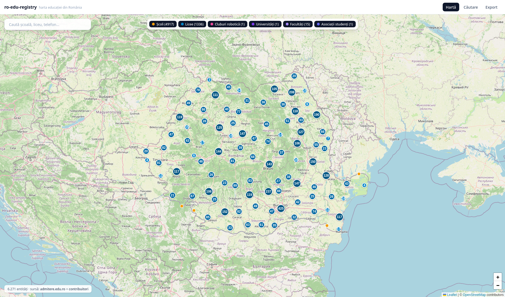

# ro-edu-registry



**A canonical, community-maintained registry of Romanian education** — schools, high schools, universities, faculties, robotics clubs and student organizations.

**Live map:** https://dynow.github.io/ro-edu-registry/

[](https://github.com/DynoW/ro-edu-registry/actions/workflows/validate.yml)
[](https://github.com/DynoW/ro-edu-registry/actions/workflows/deploy.yml)
[](#licenses)

## Why a registry, not just a map?

The map is disposable. The **dataset is the product**:

- `data/entities/*.json` is the single hand-editable source of truth, validated by JSON Schema in CI.
- Everything else (GeoJSON for the map, CSV for outreach, coverage stats) is **generated** from it — never edited, never forked.
- New use case (SMS campaign, university-fair list, a different map)? One new exporter, zero data forks.

Current coverage: **6,254 school units** across all **42 counties**, 99.4% geocoded, with admission stats from the official `admitere.edu.ro` feeds and contact links harvested from OpenStreetMap.

## The map

Vite + React + Leaflet over OpenStreetMap raster tiles — no WebGL required, no API keys, runs in any browser. Features:

- Clustering + per-kind filter chips (schools / high schools / universities / clubs / orgs)
- Diacritics-insensitive search (works without WebGL too, via a lean `search.json`)
- Per-entity modal with website / email / phone / socials
- **"Report a correction"** deep link on every entry → prefilled GitHub issue

## Repository layout

```text
data/
  entities/        # CANONICAL data — hand-editable, schema-validated
  schemas/         # JSON Schema (entity.schema.json)
scripts/           # scraper, geocoder, enricher, normalizer, exporter, formatter
public/data/       # GENERATED ONLY — gitignored, rebuilt in CI
src/               # Map frontend (Vite + React + Leaflet)
docs/              # FIELD reference per entity kind
.github/           # CI workflows + issue templates
```

## Quick start

Prerequisites: Node 22+, [pnpm](https://pnpm.io/) 10, Python 3.12+.

```bash
pnpm install
pnpm export        # regenerate public/data/ from the canonical registry
pnpm dev           # map at http://localhost:5173
```

Other commands:

```bash
pnpm build         # typecheck + production build
pnpm preview       # serve the production build locally
```

Data pipeline (offline tools, run manually when refreshing sources — never in CI, they touch live services):

```bash
python3 scripts/scraper.py      # admitere.edu.ro feeds → public/data/schools_raw.json
python3 scripts/normalize.py    # merge into canonical data/entities/schools.json
python3 scripts/geocoder.py     # Nominatim, resumable cache — coordinates
python3 scripts/enrich_osm.py   # Overpass: websites/emails/phones from OSM tags
python3 scripts/export.py       # canonical → geojson + csv + search + coverage
```

## Contributing

No build knowledge needed — contributions are plain JSON edits or GitHub issues:

- **Found wrong data?** Click *"Date greșite? Editează pe GitHub"* on any map entry, or open a [data-correction issue](https://github.com/DynoW/ro-edu-registry/issues/new?template=fix-data.yml).
- **Missing entity?** [Add-entity issue](https://github.com/DynoW/ro-edu-registry/issues/new?template=add-entity.yml) — a maintainer will add it, or send a PR yourself (see [CONTRIBUTING.md](CONTRIBUTING.md) for copy-paste JSON examples).

Every PR is automatically validated against the JSON Schema; CI regenerates all derived files at deploy time, so there is nothing else to keep in sync.

Please note: this registry targets **institutional contacts only** (secretariat@, official sites, public phones). Do not submit personal data (private individuals' emails or phone numbers) — such submissions will be rejected. See [CONTRIBUTING.md](CONTRIBUTING.md#privacy).

## Licenses

| What | License |
| :--- | :--- |
| Code (scripts, frontend, workflows) | [MIT](LICENSE) |
| Data (`data/` + all derived outputs) | [ODbL 1.0](LICENSE-DATA) — required because coordinates are derived from OpenStreetMap |

If you use the data, attribute it (see [LICENSE-DATA](LICENSE-DATA) for a ready-made notice). Map tiles remain © OpenStreetMap contributors.
